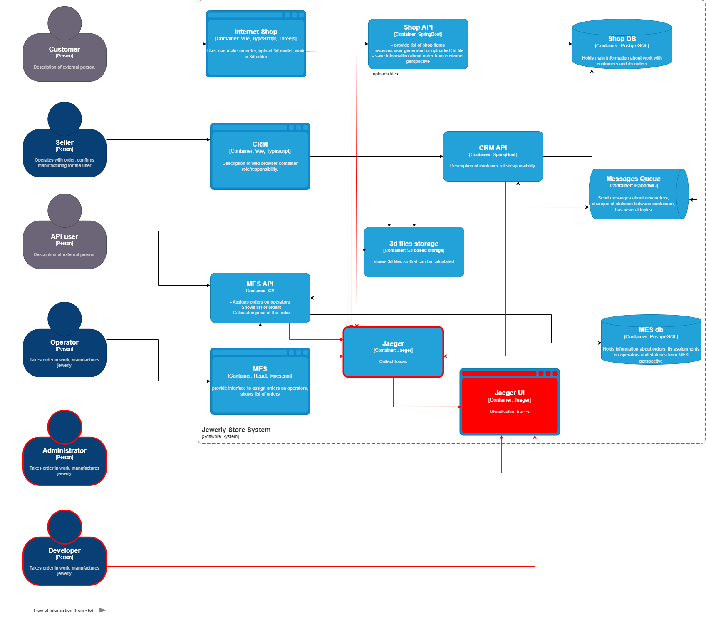

# 1. Анализ системы и проблемных мест

## Критические точки, где заказы могут "зависать" или теряться:
    Internet Shop -> Shop API -> MES API
        Заказ может не дойти из-за ошибок валидации или перегрузки очереди RabbitMQ.

    MES API -> MES (Расчет стоимости)
        Долгий расчет может блокировать очередь.

    MES API-> CRM API (Подтверждение заказа)
        Сообщения могут теряться из-за неподтвержденной доставки в RabbitMQ.

    CRM API -> MES API (Производство, MANUFACTURING_STARTED)
        Задержки из-за ручного назначения операторов. Ошибки очереди.

## Системы, которые нужно покрыть трейсингом:

    - Internet Shop, Shop API
    - MES, MES API
    - CRM, CRM API 

# 2. Данные для трейсинга
    order_id - ID Заказа, генерируем при формировании заказа в Internet Shop / MES API (При создании заказа через партнерское API)
    trace_id - Единый ID для отслеживания трейсов по заказу. Берем из OpenTelemetry
    status - Текуший статус заказа
    timestamp - Время трейса в подсистеме
    processing_time_ms - Время выполнения операции
    error (если есть) - Информация об ошибке
    service	- ID сервиса трейса
    user_id - ID клиента

# 3. Мотивация

## Почему трейсинг необходим?
    - Сокращение времени на ручное расследование инцидентов.
    - Позволяет локализовать проблемы
    - Анализ и визуализация bottleneck
    - Положительно влияет на пользовательский опыт, т.к. ускоряет поиск и решение проблем.

## Технические и бизнес-метрики, которые улучшатся:
    - Среднее время обработки заказа.
    - Количество "потерянных" заказов.
    - Время реакции на инциденты.
    - Загрузка операторов (выявление узких мест в MES).
    - SLA для B2B-партнеров (соблюдение сроков).

# 4. Предлагаемое решение
Технологии:
    Трейсинг: OpenTelemetry (поддержка Java, C#, JS).
    Хранилище трейсов: Jaeger
    Визуализация: Jaeger UI 

Реализация:
    Добавить OpenTelemetry SDK в:
        - Internet Shop, Shop API
        - MES, MES API
        - CRM, CRM API 

# 5. Компромиссы
    - Внедрение трейсинга предполагает некоторый оверхед на разработку.
    - Генерация трейсов в высоконагруженных сервисах например в Shop API может портебовать значительных ресуросов на их обработку и хранение.
    - Необходимо потратить ресурсы на обучения работы с трейсами и их поддержку разработчиков и администраторов (DevOps-ов)

# 6. Безопасность
    Аутентификация:
        Доступ к Jaeger/Jaeger только через VPN.

    Маскировка данных:
        Не логировать персональные данные.
        Шифрование трейсов при передаче c фронтенд части системы (TLS).

    Аудит доступа:
        Логировать все запросы к трейсам.
