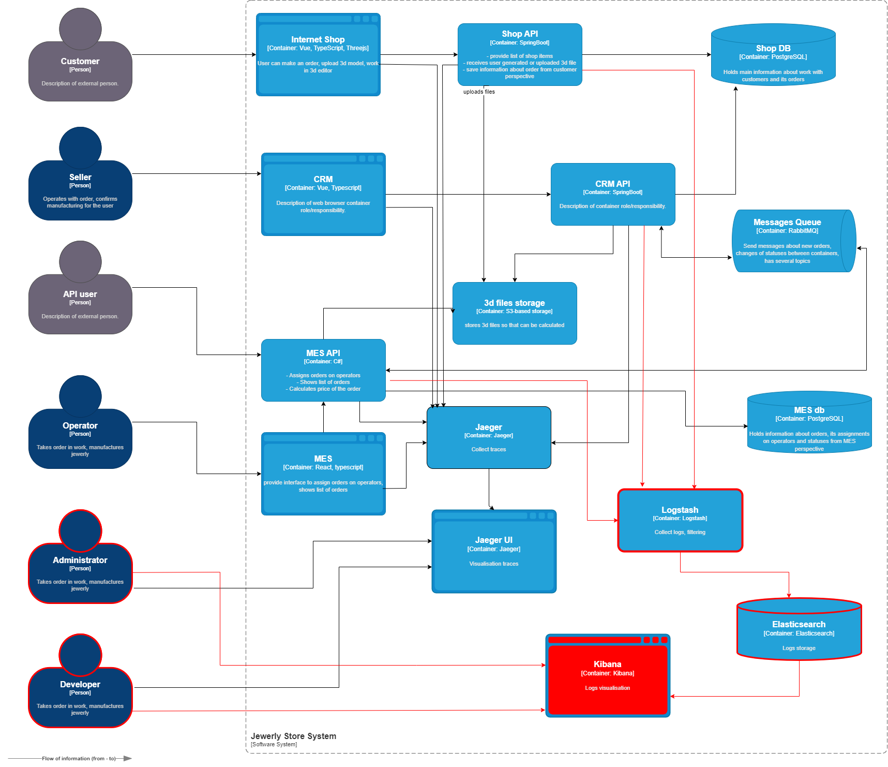

# 1. Анализ системы и необходимых логов
В системе сейчас проблемы с обработкой заказов — некоторые заказы просто теряются, и непонятно, на каком этапе это происходит. 
## Логирование поможет отследить
    - что происходит в сервисах в момент возникновения проблем
    - где именно возникают ошибки
    - какие  ошибки возникают
    - точное время возникновения ошибок
    - последлвательность ошибок.

## Возможные уровни лонирования:
A. Обычные события (INFO)
Записывать информацию о действиях пользователей и работе системы:

    Shop API - информация о запросах, времени и результатах их выполнения.
    CRM API - информация о запросах, времени и результатах их выполнения.
    MES API - информация о запросах, времени и результатах их выполнения. Информация об изменение статуса заказа.

B. Предупреждения (WARNING)
Записывать подозрительные события, но не ошибки:
    Попытки зайти без авторизации. 
    IP-адрес, ID пользователяесли известен,что именно пытались сделать.
    Любые аномальные ситуации, которые не приводят к арарийному завершению операции.

C. Ошибки (ERROR)
Записывать все сбои в системе:
    Когда произошла ошибка (точное время).
    Подробное описание ошибки (включая стектрейс — "след" выполнения программы).
    В какой операции случилась ошибка.
    Какой заказ или данные обрабатывались в этот момент.

Все логи в системы нужно выдерживать в едином стиле и формате. Формат логов следует задавать в машиночитаемом формате, для того чтобы иметь возможность их автоматизированной обработки. Большинство информации выводим в одну строку в формате key=>value. При выводе стектресов ошибок используем стандартные средства языка для формирования стектрейсов. Это позволит автоматизировать их парсиинг и обработку стандартными средствами.

# 2. Мотивация

Логирование позволяет сохранять информацию о работе системы и отдельных сервисов и производить их дальнейший анализ. Такая информаци помогает нам понять процессы происходившие в системе. Порядок обработки событий. События, приводящие к неправильной работе системы. Кроме того наличия журнала логов позволяет проводить аудит безопасности и восставновить цепочку просиходящих событий при расследование спорных систуация (например потеря заказа).

### Внедрение логирования может повлять на следуюшие метрики:
    - Время решение заявок о проблемах от клиентов
    - Время поиска и исправления ошибок системы
    - Общее кол-во ошибок в системе и частота из возникновения
    - Кореляция кол-ва ошибок от выкатки новых релизов, изменения ифраструктуры и т.д.

Вначале стои реализовать (в порядке очередности) логирование в MES API, CRM API и Shop API. Для реализации используем стандартные для технологии/языка средства лонирования.
Это позволит в кратчайщие сроки найти и устранить ощибки, приводящие к потери заказов.

# 3. Предлагаемое решение 

    Для работы с логами предлагается использовать стек ELK.

    Сбор логов и фильтрация: Logstash
    Хранение: Elasticsearch 
    Визуализация и анализ: Kibana 

    Индексация логов будет просходить по подсистемам. Время хранения нужно ограничить, для начала это может быть 1 месяц.

    Для обеспечения политики безопасности при работе с логами необходимо ограничить доступ к логам и интерфейсу их визуализации только для сотрудников, имеющих соответвующую роль. Сессии работы с Kibana записываются в журнал аудита. Чувствительные данные можно фильтровать/маскировать на этапе сбора и фильтрации.

# 4. Анализ логов и алертинг
    Необходимо настроить алертинг на возникновение наиболее критичных событий.
        - Превышение допустимого кол-во ошибок в еденицу времени при работе Shop API, CRM API, MES API
        - Появления ошибок соединения с БД. При нормальной работе системы проблем с коннективи к БД быть не должно.
        - Для аудита безопасности возможна выгрузка логов в CIEM для последующего анализа событий безопасности.
